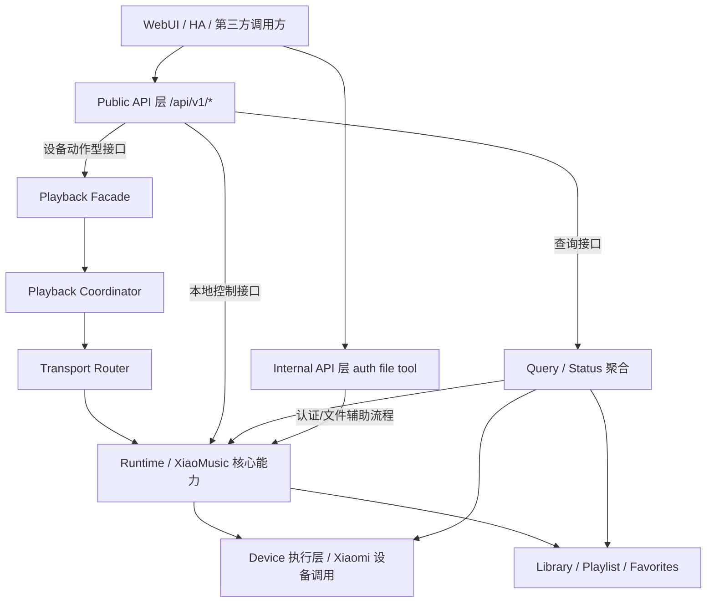

# xiaomusic-core 架构说明

本文档说明当前系统分层、模块职责与调用关系。API 契约以 `docs/api/api_v1_spec.md` 为准。

---

## 1. 文档定位

`ARCHITECTURE.md` 不是 API 契约文档。

本文档负责：

- 当前实现分层
- 模块职责与边界
- 模块调用关系

本文档不定义：

- 正式响应字段
- 错误码集合
- 接口分级（Class A / B / C）
- 内部归属约束

以上内容统一以 `docs/api/api_v1_spec.md` 为准。两者冲突时，以 `api_v1_spec.md` 为准。

---

## 2. 接口分层

### 2.1 Public API

`/api/v1/*` 白名单接口。面向 WebUI、Home Assistant、插件与第三方调用方，承诺兼容性与长期稳定性。

### 2.2 Internal API

非 v1 白名单的内部接口。仅供 WebUI 与项目内部使用，不承诺兼容性。

当前属于 Internal API 的接口：

- 认证 / 会话：`/api/auth/status`、`/api/auth/refresh`、`/api/auth/logout`、`/api/get_qrcode`
- 文件 / 工具：`/api/file/fetch_playlist_json`、`/api/file/cleantempdir`

### 2.3 Forbidden / Removed

已删除接口与禁止恢复入口：

- `/api/v1/playlist/play`、`/api/v1/playlist/play-index`
- 旧 device wrapper：`/getplayerstatus`、`/setvolume`、`/playtts`、`/device/stop`
- `*_legacy` facade 方法
- 中文命令入口、cmd 风格入口

### 2.4 调用方约束

- WebUI 可调用 Public API 与 Internal API
- 插件与第三方只能依赖 Public API
- Forbidden / Removed 不得被重新接入

---

## 3. 当前架构分层

---

## 4. 模块边界与职责

### 4.1 API Router

负责：

- 暴露 `/api/v1/*` HTTP 入口
- 解析请求参数
- 将请求路由到正确内部路径
- 统一返回 envelope

不负责：定义字段契约、承担播放编排、承担设备执行。

### 4.2 v1 路由适配层

负责：

- 接口语义到内部模块调用的映射
- 将 API 分级落到正确路径
- 保证播放请求统一经 `/api/v1/play` 进入执行路径

### 4.3 Playback Facade / Coordinator

负责：

- 统一调度链路入口
- 来源解析、资源准备与分发动作编排
- 承接 `/api/v1/play` 播放入口语义

不负责：对外提供 HTTP 协议。

### 4.4 Transport Router

负责：

- 根据动作类型、设备能力与 transport 可用性进行分发
- 形成 transport 可观测结果

### 4.5 Runtime / XiaoMusic

负责：

- 运行时核心能力
- 设备控制、本地媒体控制、状态读取
- 为统一调度链路与本地控制路径提供共享能力

### 4.6 Device 执行层

负责：

- 执行 Xiaomi 设备侧动作
- 与设备平台通信

### 4.7 Library / Playlist / Favorites

负责：

- 本地库、歌单、收藏与索引刷新
- 歌单选择、本地歌曲定位、收藏增删

### 4.8 Query / Status 聚合层

负责：

- 聚合设备状态、系统状态、播放状态
- 将多来源状态折叠成查询结果

### 4.9 WebUI

负责：

- 调用 v1 正式接口
- 根据契约展示结果
- 新播放功能通过 `/api/v1/play` 接入

---

## 5. 调用链

### 5.1 Class A 典型链路

适用接口：`POST /api/v1/play`、`POST /api/v1/control/*`

调用链：

1. 请求进入 v1 Router
2. 路由适配层交给统一调度入口
3. Facade / Coordinator 组织解析与编排
4. Transport Router 进行 transport 选择与分发
5. Runtime / Device 执行动作
6. 结果回到 v1 envelope

### 5.2 Class B 典型链路

适用接口：`POST /api/v1/control/play-mode`、`POST /api/v1/library/*`

调用链：

1. 请求进入 v1 Router
2. 路由适配层交给 router / runtime 本地路径
3. Runtime 调用 Library / Playlist / Favorites 能力
4. 结果回到统一 envelope

### 5.3 Class C 典型链路

适用接口：`GET /api/v1/system/status`、`GET /api/v1/devices`、`GET /api/v1/player/state`

调用链：

1. 请求进入 v1 Router
2. 路由适配层交给查询 / 聚合路径
3. Query / Status 聚合层读取结果
4. 聚合结果回到统一 envelope

---

## 6. 关键文档导航

| 文档 | 说明 |
|---|---|
| [docs/api/api_v1_spec.md](docs/api/api_v1_spec.md) | v1 API 唯一权威契约 |
| [docs/spec/runtime_specification.md](docs/spec/runtime_specification.md) | Runtime 技术规范 |
| [docs/spec/playback_coordinator_interface.md](docs/spec/playback_coordinator_interface.md) | 播放编排接口 |
| [docs/spec/auth_runtime_recovery.md](docs/spec/auth_runtime_recovery.md) | 认证运行时恢复规范 |
| [docs/authentication_architecture.md](docs/authentication_architecture.md) | 认证系统架构 |
| [docs/architecture/](docs/architecture/) | 架构细分文档 |
