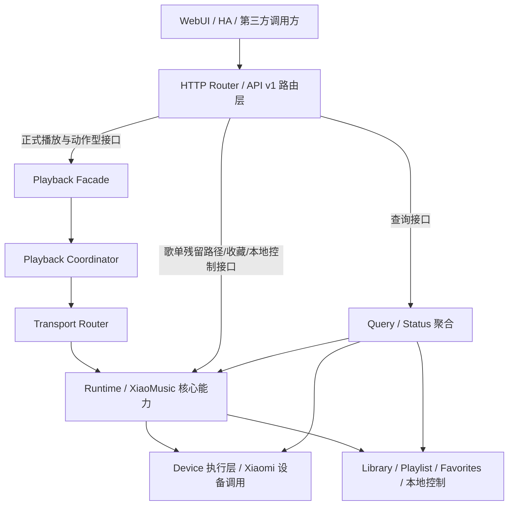
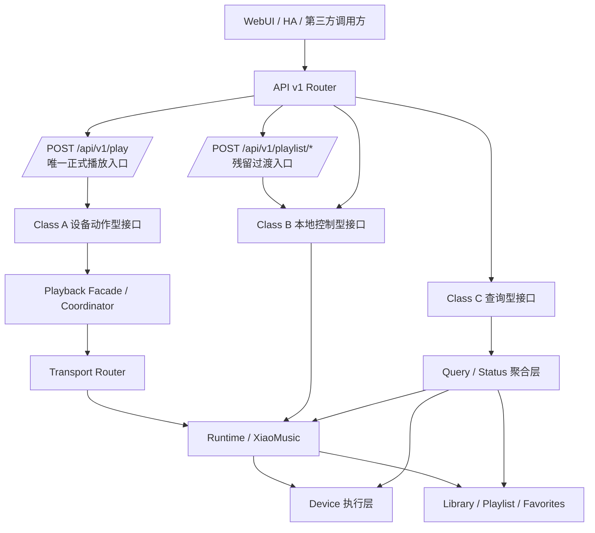

# xiaomusic-core 架构说明

本文档只承担架构说明与演进说明职责，不定义 v1 API 正式契约。

---

## 1. 文档定位与优先级

### 1.1 文档定位

`ARCHITECTURE.md` 不是 API 契约文档。

本文档只负责说明以下内容：

- 当前实现分层
- 模块职责与边界
- 模块调用关系
- 当前双轨现状
- 目标收敛方向

### 1.2 与 API 契约文档的优先级关系

v1 API 的以下内容统一以 `docs/api/api_v1_spec.md` 为准：

- 对外接口行为
- 请求字段与响应字段
- 错误模型
- 接口分级（Class A / B / C）
- 内部归属约束

当本文档与 `docs/api/api_v1_spec.md` 冲突时，一律以 `docs/api/api_v1_spec.md` 为准。

其中与播放入口直接相关的约束也以 `docs/api/api_v1_spec.md` 为准：

- `POST /api/v1/play` 是唯一正式播放入口
- `/api/v1/playlist/*` 不属于正式播放入口

### 1.3 本文档不承担的职责

本文档不定义：

- 正式响应字段
- 错误码集合
- 哪个字段对外必返
- 哪个接口对外必须返回何种 envelope 细节

这些内容均属于 API 契约，不属于架构说明。

---

## 2. 当前架构现状

### 2.1 当前现状概述

当前项目存在双轨结构：

- 一部分接口已经或应走统一调度 / 分发链路
- 另一部分接口当前保留在 router / runtime 本地控制路径

在当前现状中，`POST /api/v1/play` 已被设计为统一播放入口；`/api/v1/playlist/*` 仍是历史残留路径的一部分，但这种并存只表示现状，不表示它们仍是长期正式播放入口。

这种双轨结构是当前实现现状说明，不是契约授权；接口是否允许走哪条路径，以 `docs/api/api_v1_spec.md` 的分类与归属约束为准。

### 2.2 当前架构现状图

图中表达的只是当前实现分层与调用方向，不代表所有接口都已经稳定收敛到相同内部路径。

### 2.3 当前双轨含义

当前双轨的含义是：

- 统一调度链路负责设备动作型能力，强调分发、调度与 transport 观测
- router / runtime 本地路径负责一部分歌单、收藏、本地控制与查询聚合能力

当前双轨存在的风险是：

- 路径差异容易被误写成契约差异
- 实现细节容易被前端误读为稳定字段
- 架构说明容易越界成第二份 API 规范

---

## 3. 目标架构

### 3.1 目标架构原则

目标架构不是“所有接口走同一条内部路径”，而是“不同类型接口进入各自明确、受约束、可解释的路径”。

目标收敛必须与 `docs/api/api_v1_spec.md` 的 Class A / B / C 分类保持一致。

对于播放入口，目标架构还必须满足：

- 所有正式播放请求经 `POST /api/v1/play` 进入统一播放执行路径
- `/api/v1/playlist/*` 不再作为正式并列播放入口存在

### 3.2 目标架构图

### 3.3 目标分层解释

#### Class A

- 归属统一调度 / 分发链路
- 典型路径：Router -> Facade / Coordinator -> Transport Router -> Runtime / Device
- 核心特征：设备动作执行与 transport 可观测性
- 正式播放请求只能通过 `POST /api/v1/play` 进入该链路

#### Class B

- 允许保留在 router / runtime 本地控制路径
- 核心特征：本地控制、歌单控制、收藏控制、库刷新
- 约束重点：统一 envelope、统一错误模型、不伪装成 Class A
- `/api/v1/playlist/*` 若仍存在，只是过渡接口，不是正式播放入口

#### Class C

- 归属只读查询 / 聚合路径
- 核心特征：查询与状态聚合
- 不要求 transport

---

## 4. 模块边界与职责

### 4.1 API Router

负责：

- 暴露 `/api/v1/*` HTTP 入口
- 解析请求参数与基本边界输入
- 将请求路由到正确的内部路径
- 统一返回 envelope

不负责：

- 定义正式字段契约
- 承担播放编排逻辑
- 承担设备执行细节

上下游交互：

- 上游接收 WebUI / HA / 第三方调用
- 下游调用统一调度链路、本地控制路径或查询聚合路径

经过它的接口：

- 所有 v1 白名单接口

### 4.2 v1 路由适配层

负责：

- 在 `xiaomusic/api/routers/v1.py` 中完成接口语义到内部模块调用的映射
- 将 API 分级落到正确路径上
- 保证正式播放请求统一经 `/api/v1/play` 进入播放执行路径

不负责：

- 直接承诺业务字段的稳定性
- 直接替代 Runtime / Device 的业务实现

上下游交互：

- 上游为 API Router
- 下游为 Facade、Runtime、本地控制与查询聚合逻辑

经过它的接口：

- 所有 v1 白名单接口

### 4.3 Playback Facade / Coordinator

负责：

- 承接统一调度链路的入口
- 协调来源解析、资源准备与分发动作
- 组织 Class A 路径中的播放与设备动作编排
- 承接 `/api/v1/play` 对应的正式播放入口语义

不负责：

- 直接对外提供 HTTP 协议
- 伪装 Class B / Class C 为统一播放型接口

上下游交互：

- 上游为 v1 路由适配层
- 下游为 Transport Router、Runtime 支撑能力

经过它的接口：

- Class A 为主

### 4.4 Transport Router

负责：

- 根据动作类型、设备能力与可用 transport 进行分发
- 形成设备动作型接口的 transport 可观测结果

不负责：

- 定义对外 API 字段
- 承担本地歌单、收藏、库刷新等本地控制职责

上下游交互：

- 上游为 Facade / Coordinator
- 下游为 Runtime / Device 执行层

经过它的接口：

- Class A

### 4.5 Runtime / XiaoMusic

负责：

- 承载运行时核心能力
- 提供设备控制、本地媒体控制、状态读取等能力入口
- 为统一调度链路与本地控制路径提供共享能力

不负责：

- 充当 HTTP 契约定义层
- 直接替代 Router 的输入输出协议边界职责

上下游交互：

- 上游接收 Facade / Coordinator、router/runtime 本地路径、查询聚合层调用
- 下游调用 Device、Library、播放与状态能力

经过它的接口：

- Class A / B / C 均可能经过 Runtime，但经过方式不同

### 4.6 Device 执行层

负责：

- 执行 Xiaomi 设备侧动作
- 与设备平台通信
- 落实播放、暂停、停止、上一首、下一首等设备动作

不负责：

- 决定 HTTP 接口分类
- 定义 API 成功返回结构

上下游交互：

- 上游为 Runtime 或 Transport Router
- 下游为 Xiaomi 设备接口与设备状态

经过它的接口：

- 主要为 Class A

### 4.7 Library / Playlist / Favorites

负责：

- 本地库、歌单、收藏与索引刷新相关能力
- 歌单选择、本地歌曲定位、收藏增删等本地控制语义

不负责：

- 提供 transport 语义
- 伪装成统一调度型动作链路
- 定义正式播放入口

上下游交互：

- 上游为 Runtime / 本地控制路径
- 下游为本地库数据与歌单状态

经过它的接口：

- Class B 为主

### 4.8 Query / Status 聚合层

负责：

- 聚合设备状态、系统状态、播放状态与只读查询结果
- 将多来源状态折叠成查询接口可返回的结果

不负责：

- 执行设备动作
- 承诺 transport 语义

上下游交互：

- 上游为 API Router / v1 路由适配层
- 下游为 Runtime、Device、Library 等状态来源

经过它的接口：

- Class C

### 4.9 WebUI

负责：

- 调用 v1 正式接口
- 根据契约展示结果和错误信息
- 新播放功能通过 `/api/v1/play` 接入

不负责：

- 推断未在 spec 中承诺的字段
- 以页面假设定义后端契约
- 把 `/api/v1/playlist/*` 当作长期正式播放入口

上下游交互：

- 上游为用户操作
- 下游为 API Router

经过它的接口：

- 所有需要的 Class A / B / C 接口

---

## 5. 调用链说明

### 5.1 Class A 典型链路

适用接口示例：

- `POST /api/v1/play`
- `POST /api/v1/control/previous`
- `POST /api/v1/control/next`

典型调用链：

1. 请求进入 v1 Router
2. 路由适配层将请求交给统一调度入口
3. Facade / Coordinator 组织解析、编排或动作执行
4. Transport Router 进行 transport 选择与分发
5. Runtime / Device 执行动作
6. 结果回到 v1 envelope

架构含义：

- Class A 的关键不只是“能执行动作”，而是“动作通过统一调度 / 分发链路执行，且 transport 可观测”
- 其中正式播放请求的唯一入口是 `POST /api/v1/play`

### 5.2 Class B 典型链路

适用接口示例：

- `POST /api/v1/control/play-mode`
- `POST /api/v1/library/refresh`
- `POST /api/v1/playlist/play`（残留过渡路径）

典型调用链：

1. 请求进入 v1 Router
2. 路由适配层将请求交给 router / runtime 本地路径
3. Runtime 调用 Library / Playlist / Favorites / 本地控制能力
4. 结果回到统一 envelope

架构含义：

- Class B 的关键不是 transport
- Class B 不应被包装成 Class A 的响应形态
- 该类接口仍必须输出统一 envelope 与结构化错误
- `/api/v1/playlist/*` 当前若仍保留在 Class B 路径中，只表示历史残留实现，不表示其仍是目标态正式播放入口

### 5.3 Class C 典型链路

适用接口示例：

- `GET /api/v1/system/status`
- `GET /api/v1/devices`
- `GET /api/v1/player/state`
- `POST /api/v1/resolve`

典型调用链：

1. 请求进入 v1 Router
2. 路由适配层将请求交给查询 / 聚合路径
3. Query / Status 聚合层从 Runtime、Device、Library 或解析模块读取结果
4. 聚合结果回到统一 envelope

架构含义：

- Class C 面向查询可读性
- 不要求 transport
- 结果字段以 spec 中声明的查询契约为准，而不是以内部聚合对象现状为准

---

## 6. 当前问题与收敛方向

### 6.1 当前问题

当前架构层面的主要问题包括：

1. 双轨并存时，路径差异容易大于契约差异，导致文档漂移
2. 若不区分 A / B / C，接口容易被误要求同构
3. 查询接口、歌单接口、本地控制接口容易被错误套入播放动作型契约
4. 若架构文档越界描述字段与返回模型，就会与 API 契约文档发生冲突
5. 若继续把 `/api/v1/playlist/*` 当作正式播放入口，会削弱统一播放状态机与唯一播放入口模型

### 6.2 收敛方向

目标不是“所有接口都进入同一内部路径”，而是：

- Class A 进入统一调度 / 分发链路
- Class B 进入受约束的本地控制路径
- Class C 进入受约束的只读查询 / 聚合路径
- 正式播放入口收敛到 `/api/v1/play`
- `/api/v1/playlist/*` 逐步退化为过渡期上下文桥接接口

收敛重点是：

- 路径边界明确
- 接口类型明确
- 契约与实现分层明确
- 架构说明不再替代 API 契约

---

## 7. 与 API 契约文档的关系

### 7.1 架构文档不定义契约细节

`ARCHITECTURE.md` 不定义：

- 正式响应字段
- 错误码集合
- 哪个字段对外必返
- 哪个接口必须返回什么成功载荷

这些内容统一由 `docs/api/api_v1_spec.md` 定义。

### 7.2 修改顺序要求

若需要修改接口契约，应遵循以下顺序：

1. 先修改 `docs/api/api_v1_spec.md`
2. 再修改实现
3. 最后更新 `ARCHITECTURE.md` 中与模块路径、分层解释、收敛阶段相关的说明

### 7.3 统一播放入口的架构约束

- `ARCHITECTURE.md` 不定义新的正式播放入口
- 目标架构中只有 `POST /api/v1/play` 可以承载正式播放入口语义
- `/api/v1/playlist/*` 在架构说明中只能作为当前残留路径或过渡桥接路径出现
- 新前端功能不得新增对 `/api/v1/playlist/*` 的依赖
- 新插件与新来源扩展必须通过统一播放入口接入

### 7.4 文档协作关系

- `docs/api/api_v1_spec.md` 负责“接口怎么承诺”
- `ARCHITECTURE.md` 负责“系统如何分层、模块如何协作、当前处于什么阶段、目标收敛到哪里”

---

## 8. 关键文档导航

| 文档 | 说明 |
|---|---|
| [docs/api/api_v1_spec.md](docs/api/api_v1_spec.md) | v1 API 的唯一权威契约来源 |
| [docs/spec/runtime_specification.md](docs/spec/runtime_specification.md) | Runtime 相关模型与技术规范 |
| [docs/spec/playback_coordinator_interface.md](docs/spec/playback_coordinator_interface.md) | 播放编排接口说明 |
| [docs/spec/auth_runtime_recovery.md](docs/spec/auth_runtime_recovery.md) | 认证运行时恢复规范 |
| [docs/authentication_architecture.md](docs/authentication_architecture.md) | 认证系统架构说明 |
| [docs/dev/runtime_contracts.md](docs/dev/runtime_contracts.md) | Runtime 合同与内部约束补充 |
| [docs/dev/source_transport_matrix.md](docs/dev/source_transport_matrix.md) | 来源 / 传输能力矩阵 |
| [docs/architecture/](docs/architecture/) | 更细粒度的架构分析与重构设计文档 |

---

## 9. 本次修改说明（供审阅）

1. 我将 `ARCHITECTURE.md` 与 `docs/api/api_v1_spec.md` 的优先级关系写明为：API 契约、字段、错误模型、接口分级与内部归属约束统一以 `docs/api/api_v1_spec.md` 为准，架构文档不再承担第二份契约职责。
2. 我将“当前现状图”和“目标架构图”明确分开：前者描述当前双轨并存的实现状态，后者描述按照 Class A / B / C 收敛后的目标归属。
3. 我把双轨结构写成“当前实现现状说明”，而不是“契约授权”；并明确指出双轨存在的风险是路径差异引发文档漂移，而不是为模糊契约提供合法性。
4. 三类接口在架构图中的归属体现为：Class A 进入统一调度 / 分发链路，Class B 进入 router / runtime 本地控制路径，Class C 进入只读查询 / 聚合路径。
5. 本步仍然不涉及代码改动，因为本次任务目标是修正文档角色边界与架构说明方式，避免架构文档与 API 契约文档冲突；实现收敛属于后续代码步骤。

## 10. 本次修改说明（供审阅）

1. 本次依据历史统一播放模型中的原则修正了播放入口定义：`/api/v1/play` 是唯一正式播放入口，所有正式播放请求最终进入统一播放执行路径；`/api/v1/playlist/*` 不再被当作并列正式入口。
2. 我将 `/api/v1/play` 与 `/api/v1/playlist/*` 的关系改写为：前者是目标态唯一正式播放入口，后者只在“当前现状”或“过渡桥接”语境中出现。
3. 被删除、降级或改写的旧表述包括：
   - 可能让人误解 `playlist/*` 与 `/api/v1/play` 并列承担播放入口职责的描述
   - 在目标架构里将多个播放入口并列进入统一链路的风险表述
4. 本次受影响的章节包括：
   - `ARCHITECTURE.md` 的文档优先级、当前架构现状、目标架构图、模块边界、调用链说明、当前问题与收敛方向、与 API 契约文档的关系
5. 本步不涉及代码修改，因为本次任务目标是先把“唯一正式播放入口”的架构与契约叙述统一；实际入口收敛与状态机迁移属于后续代码步骤。
