# S2-3: 生命周期分析

## Async Task 创建点总表

| 创建位置 | 任务名称/类型 | 持有者 | 取消机制 | 风险 |
|----------|--------------|--------|----------|------|
| xiaomusic.py:303 | `_library_refresh_task` | xiaomusic | 重建时检查 `done()` | 低：coalescing设计 |
| xiaomusic.py:321 | `send_startup_event` | xiaomusic | 无（一次性） | 低 |
| xiaomusic.py:325 | `analytics_task_daily` | xiaomusic | 无（run_forever） | 中：未显式取消 |
| xiaomusic.py:332 | `keepalive_task` | xiaomusic | finally中cancel | 低 |
| device_player.py:308 | `_autonext_guard_task` | XiaoMusicDevice | cancel+done检查+session_id判断 | 中：3重保护但复杂 |
| device_player.py:407 | `_duration_probe_task` | XiaoMusicDevice | cancel+done检查 | 低 |
| device_player.py:437 | `_add_song_timer` | XiaoMusicDevice | cancel+done检查 | 低 |
| device_player.py:763 | `group_force_stop_xiaoai` | XiaoMusicDevice | fire-and-forget | **高：无跟踪** |
| device_player.py:1036 | `_playback_confirm_runner` | XiaoMusicDevice | cancel+done检查 | 低 |
| device_player.py:1126 | `_playback_status_probe_runner` | XiaoMusicDevice | cancel+done检查 | 低 |
| device_player.py:1655 | `_tts_timer` | XiaoMusicDevice | cancel+done检查 | 低 |
| device_player.py:1985 | `_next_timer` | XiaoMusicDevice | cancel+done检查 | 低 |
| device_player.py:2037 | `_retry_next` | XiaoMusicDevice | fire-and-forget | **高：无跟踪** |
| device_player.py:2168 | `_stop_timer` | XiaoMusicDevice | cancel+done检查 | 低 |
| conversation.py:69 | `poll_latest_ask` | ConversationPoller | 未明确 | **中：无owner记录** |
| auth.py:1749 | `_recovery_task` | AuthManager | cancel+done检查 | 低 |
| api/routers/device.py:65 | `do_check_cmd` | xiaomusic | append_running_task跟踪 | 中：异常路径可能遗漏 |
| api/routers/system.py:153 | `get_logint_status` | - | 无 | **高：fire-and-forget** |
| api/routers/system.py:633 | `restart_xiaomusic` | - | 无 | **高：fire-and-forget** |
| api/app.py:37 | `run_forever` | xiaomusic | 整个应用生命周期 | 低 |
| api/routers/file.py:211 | `check_download_proc` | - | 无 | **高：fire-and-forget** |
| api/routers/file.py:304 | `check_download_proc` | - | 无 | **高：fire-and-forget** |
| services/online_music_service.py:108,120,129 | plugin/openapi/jellyfin sync | OnlineMusicService | 无 | **高：无owner** |

## 资源创建/销毁点

### 资源创建

| 资源 | 创建点 | 销毁点 | 生命周期管理 |
|------|--------|--------|--------------|
| 日志文件 | xiaomusic.py:setup_logger | restart时close | 正常 |
| 文件监控器 | xiaomusic.py:start_file_watch | stop_file_watch | 依赖配置开关 |
| device_manager | xiaomusic.py:__init__ | 无 | 全生命周期 |
| XiaoMusicDevice实例 | device_manager:__init__ / _update_devices | cancel_all_timer | 设备变更时重建 |
| stream_server | relay/runtime.py:ensure_started | 无显式close | 按需启动 |
| http connection | api/app.py | 无 | 依赖FastAPI生命周期 |
| token_store | xiaomusic.py:__init__ | 无 | 全生命周期 |

### 资源销毁

| 资源 | 销毁方式 | 覆盖路径 |
|------|----------|----------|
| `running_task` 中的任务 | cancel_all_tasks遍历取消 | 异常路径可能遗漏 |
| `keepalive_task` | finally中cancel+gather | 完整 |
| `file_watcher` | stop_file_watch | 依赖配置开关和saveconfig路径 |
| `XiaoMusicDevice timers` | cancel_all_timer | 设备变更时调用 |
| `conversation_poller` | 无显式cancel | 异常时可能泄漏 |
| `analytics_task_daily` | 无 | 应用退出时随进程终止 |

## 生命周期表格（Mermaid）

```mermaid
gantt
    title xiaomusic-core 生命周期
    dateFormat X
    axisFormat %s

    section init
    xiaomusic.__init__    :done, 0, 100
    device_manager init   :done, 10, 100
    auth_manager init     :done, 20, 100
    event_bus init        :done, 10, 100

    section tasks
    run_forever (app life) :done, 30, 100
    keepalive_task        :active, 40, 80
    analytics_task_daily  :active, 40, 80
    conversation_poller   :active, 40, 80
    library_refresh_task  :active, 50, 70
    per-device tasks      :active, 40, 80

    section cleanup
    cancel_all_tasks      :milestone, 100, 100
    file_watcher.stop     :milestone, 100, 100
    device timers cancel  :milestone, 100, 100
```

## 危险信号

### 1. Zombie Task

- `services/online_music_service.py` 中创建的 plugin_task/openapi_task/jellyfin_task 无owner跟踪，异常退出时可能成为僵尸
- `api/routers/system.py:633` 的 `restart_xiaomusic` fire-and-forget，restart后旧任务未等待

### 2. Ghost Session

- `conversation.py` 中的 `poll_latest_ask` 任务未在 owner 端维护跟踪机制，如果轮询器重建，旧的轮询任务可能继续运行
- `api/routers/file.py` 中 `check_download_proc` 任务无跟踪，如果下载管理器已清理，任务可能继续尝试操作

### 3. 无人管理的 Async Task

- `analytics_task_daily` 随 `run_forever` 创建，但 `cancel_all_tasks` 未遍历此任务
- `xiaomusic.running_task` 只记录 `do_check_cmd` 任务，其他类型任务均不在跟踪范围内

### 4. 资源泄漏风险

- `relay/runtime.py` 的 `stream_server` 在 `ensure_started` 中启动，但没有显式的 `stop()` 方法
- `file_watcher` 的 `start()`/`stop()` 依赖配置开关，配置更新路径（`saveconfig`）会调用 `start/stop`，但异常路径可能遗漏

### 5. 生命周期不完整的模块

- `ConversationPoller` 的 `poll_latest_ask` 任务创建在 `run_conversation_loop` 内部，但没有对应的 `stop()` 或 `cancel()` 方法
- `OnlineMusicService` 创建多个后台任务，但没有提供 `shutdown()` 或 `cancel_all()` 接口

## 结论

1. **Task Owner 缺失**：多数异步任务创建后未记录 owner，异常路径无法自动清理
2. **Fire-and-forget 滥用**：部分关键路径（restart、download check、login status）使用 fire-and-forget，风险不可控
3. **cancel_all_tasks 覆盖不全**：只处理 `running_task` 列表，未涵盖全量异步任务
4. **RelayRuntime 无 shutdown**：stream_server 无显式关闭接口，长期运行可能累积资源