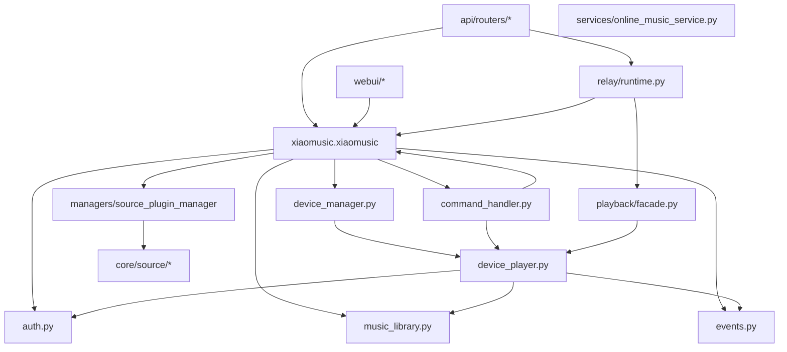
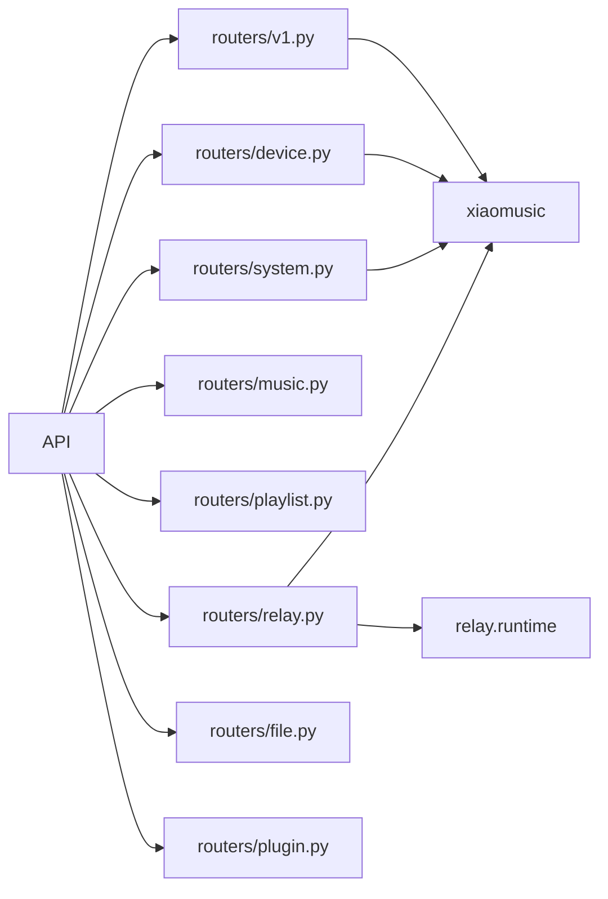

# S2-1: 运行时依赖分析

## 模块职责与边界

### 主要模块

| 模块 | 职责 | 入口文件 | 核心状态 |
|------|------|----------|----------|
| `xiaomusic.xiaomusic` | 应用主入口，组件编排 | `xiaomusic.py` | config, event_bus, auth_manager, device_manager, music_library |
| `xiaomusic.auth` | 认证生命周期、token管理 | `auth.py` | _auth_state, _tokens, _mina_token |
| `xiaomusic.device_manager` | 设备列表管理 | `device_manager.py` | devices, groups |
| `xiaomusic.device_player` | 单设备播放控制 | `device_player.py` | is_playing, _play_list, _start_time |
| `xiaomusic.music_library` | 音乐库、播放列表 | `music_library.py` | music_list, music_tags |
| `xiaomusic.command_handler` | 命令解析分发 | `command_handler.py` | - |
| `xiaomusic.api` | HTTP API层 | `api/` | - |
| `xiaomusic.webui` | WebUI静态文件服务 | `webui/` | - |
| `xiaomusic.events` | 事件总线 | `events.py` | _subscribers |
| `relay.runtime` | 流媒体转发 | `relay/runtime.py` | stream_port, session_manager |
| `core.source` | Source 抽象层 | `core/source/` | - |
| `adapters/sources/*` | Source 插件实现 | `adapters/sources/` | - |
| `managers/source_plugin_manager` | Source 插件管理 | `managers/source_plugin_manager.py` | - |

## 完整调用链（Mermaid Flowchart）

## 状态持有分析

| 节点 | 持有状态 | 生命周期问题 |
|------|----------|--------------|
| `XiaoMusic` | config, event_bus, auth_manager, device_manager, music_library, running_task | 单一实例，全生命周期 |
| `AuthManager` | _auth_state, _tokens, _mina_token, _recovery_task, device_manager | 运行时持续活动 |
| `DeviceManager` | devices, device_id_did, groups | 可重建（update_device_info） |
| `XiaoMusicDevice` | is_playing, _play_list, _start_time, _next_timer, _duration_probe_task | per-device, 独立生命周期 |
| `MusicLibrary` | music_list, music_tags | 可重建（gen_all_music_list） |
| `EventBus` | _subscribers | 全局单例 |
| `RelayRuntime` | stream_server, session_manager, resolver_cache | 延迟初始化，按需启动 |

## 危险信号

### 1. 跨层直接依赖

- `XiaoMusicDevice.__init__` 直接持有 `xiaomusic` 实例引用（self.xiaomusic），可访问整个应用状态
- `device_player.py` 多处直接调用 `self.xiaomusic.music_library`、`self.xiaomusic.analytics` 等
- `OnlineMusicService.__init__` 持有 `xiaomusic_instance` 引用，可直接操作全局状态

### 2. 双向依赖

- `auth.py` → `device_manager` → `device_player` → `auth.py`：auth_manager 被传入 DeviceManager，DeviceManager 创建设备时传入 xiaomusic，设备又持有 auth_manager
- `xiaomusic.py` → `device_manager` → `devices[did]` → `xiaomusic`：循环引用

### 3. 循环依赖风险

- `PlaybackFacade` 接受 `runtime_provider` 回调，但自身被 `v1.py` 和 `relay.py` 共同引用
- `SiteMediaSourcePlugin` 接受 `runtime_provider`，但 source 插件通过 plugin_manager 关联回 xiaomusic

### 4. 职责不清晰的模块

- `xiaomusic.py`（XiaoMusic主类）承担了配置、日志、插件初始化、轮询器、命令处理、文件监控等大量职责
- `auth.py`（AuthManager）承担了认证状态、runtime管理、device信息、轮询、恢复逻辑等，代码量极大（2000+行）
- `relay/runtime.py`（RelayRuntime）承担了流媒体服务器、会话管理、解析器、音频流、代理策略等，职责过重

## API 层入口

## 结论

核心问题：
1. **XiaoMusicDevice 持有 xiaomusic 引用**：违反最小暴露原则，设备模块可访问全局状态
2. **循环引用链路**：`xiaomusic ↔ device_manager ↔ device_player` 形成闭环
3. **AuthManager 职责过重**：认证、runtime、device管理、轮询全在一起
4. **RelayRuntime 依赖 xiaomusic**：如果 relay 需独立运行存在障碍