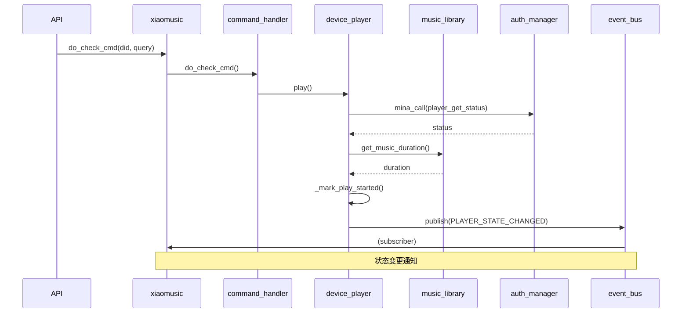

# S2-2: 状态流分析

## 状态变量总表

| 状态变量 | 所在模块 | 类型 | 初始来源 | 持久化 |
|----------|----------|------|----------|--------|
| `auth_state` | auth.py | enum(HEALTHY/RELOGGING/UNHEALTHY) | API调用 | 否 |
| `_mina_token` | auth.py | str | 小米API | TokenStore持久化 |
| `_account_token` | auth.py | str | 小米API | TokenStore持久化 |
| `_cookies` | auth.py | dict | 小米API | TokenStore持久化 |
| `runtime_auth_ready` | auth.py | bool | 内部计算 | 否 |
| `device_manager.devices` | device_manager.py | dict[did, XiaoMusicDevice] | 配置+API | 否 |
| `device_manager.groups` | device_manager.py | dict[group, device_ids] | 配置 | 否 |
| `device_id_did` | device_manager.py | dict[device_id, did] | 配置 | 否 |
| `is_playing` | device_player.py | bool | 运行时 | 否 |
| `_start_time` | device_player.py | float | 运行时 | 否 |
| `_duration` | device_player.py | float | API查询/文件分析 | 否 |
| `_paused_time` | device_player.py | float | 运行时 | 否 |
| `_play_list` | device_player.py | list[str] | 运行时 | 否 |
| `_play_list_items` | device_player.py | list[dict] | music_library | 否 |
| `_current_index` | device_player.py | int | 运行时 | 否 |
| `cur_music` | device.model | str | 运行时 | 否 |
| `cur_playlist` | device.model | str | 运行时 | 否 |
| `current_entity_id` | device.model | str | 运行时 | 否 |
| `current_display_name` | device.model | str | 运行时 | 否 |
| `music_library.music_list` | music_library.py | dict[name, list] | 配置文件/扫描 | 是(json文件) |
| `event_bus._subscribers` | events.py | dict | 运行时 | 否 |
| `xiaomusic.running_task` | xiaomusic.py | list[task] | 运行时 | 否 |
| `config.*` | config.py | dataclass | 配置文件 | 是 |
| `device_manager.devices[did]._next_timer` | device_player.py | asyncio.Task\|None | 运行时 | 否 |
| `device_manager.devices[did]._stop_timer` | device_player.py | asyncio.Task\|None | 运行时 | 否 |
| `device_manager.devices[did]._duration_probe_task` | device_player.py | asyncio.Task\|None | 运行时 | 否 |
| `auth_manager._recovery_task` | auth.py | asyncio.Task\|None | 运行时 | 否 |
| `relay_runtime.session_manager` | relay/runtime.py | StreamSessionManager | 运行时 | 否 |

## 状态变化路径

### 播放状态变化路径

```
用户请求播放
  → API /cmd (device.py:do_cmd)
    → xiaomusic.do_check_cmd()
      → command_handler.match_cmd()
        → device_player.play()
          → _mark_play_started()
            → is_playing = True
            → _start_time = time.time()
            → 发布 PLAYER_STATE_CHANGED 事件
            → 设置 _next_timer
```

### 认证状态变化路径

```
认证流程 (auth.py)
  → ensure_logged_in()
    → init_all_data()
      → AUTH_STATE: HEALTHY
      → runtime_auth_ready = True

认证失效 (auth.py)
  → _do_relogin()
    → AUTH_STATE: RELOGGING
    → _do_recovery()
      → AUTH_STATE: UNHEALTHY 或 HEALTHY
```

### 设备列表变化路径

```
配置变更或登录刷新
  → device_manager.update_device_info()
    → auth_manager.try_update_device_id()
      → _update_devices()
        → 新建/复用 XiaoMusicDevice 实例
        → 更新 device_id_did, groups
```

## 状态流图（Mermaid Sequence）



## 危险信号

### 1. 状态双写

- `device_player.py` 中 `device.cur_music`、`device.current_display_name`、`device.current_entity_id` 三个字段同时存在，内容高度重复，职责边界不清晰
- `_set_runtime_track_reference` 同时更新 device 属性和 `_current_index`
- `music_library.music_list` 和 `music_library.get_playlist_items` 可能返回同一份数据的不同视图

### 2. 轮询状态

- `device_player.py` 的 `get_offset_duration()` 内部包含复杂的自愈逻辑（检查播放超时后自动切歌），但这是通过轮询 `_start_time` 和 `_duration` 计算的，不是事件驱动
- `_autonext_guard_task` 在播放超时时触发 `_play_next()`，但依赖 `get_if_xiaoai_is_playing()` 的轮询结果

### 3. 状态漂移

- `is_playing` 和 `get_if_xiaoai_is_playing()` 可能不同步：内存中的 `is_playing` 是乐观值，实际播放状态需要通过 API 查询确认
- `_play_session_id` 用于判断超时任务是否属于当前播放会话，但如果设备意外重启，会话ID可能失效

### 4. 隐式状态依赖

- `device_player.py` 的多处方法依赖 `self.xiaomusic` 的间接状态（`xiaomusic.music_library`、`xiaomusic.analytics`），没有明确的 API 接口
- `music_library.music_list` 修改后，`device_player._play_list` 不会自动同步

### 5. 无人管理的状态

- `running_task` 列表在 `cancel_all_tasks` 时遍历清理，但某些路径下可能遗漏（如异常退出）
- `_library_refresh_task` 在 `_queue_library_refresh` 中检查 `is None` 或 `done()`，但如果任务抛出异常未被捕获，`done()` 可能永远不为 True

## 结论

1. **状态权威不明确**：`device_player` 和 `music_library` 各持有一份播放相关状态，缺少唯一权威
2. **轮询驱动逻辑**：自动切歌、播放确认等核心逻辑依赖轮询而非事件通知
3. **隐式状态共享**：模块间通过 `xiaomusic` 实例传递状态，缺乏明确接口契约
4. **会话管理脆弱**：`_play_session_id` 是防止过期任务执行的唯一手段，但覆盖路径较多